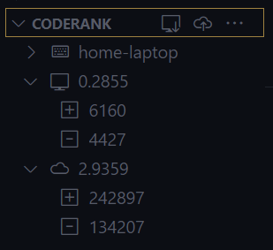
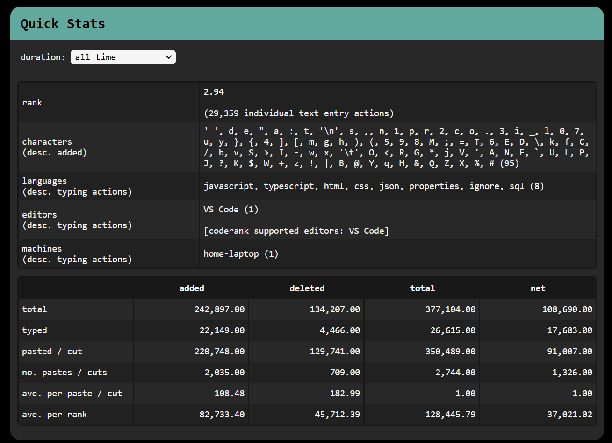
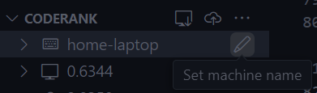
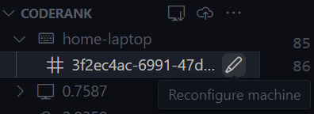

<div align="center">


# Coderank


</div>


<p align="center">
 Curious how many semicolons you typed last week? What about double quotes over the past five years? Want to present your typing prowess on your GitHub profile like <a href="https://reidspreiter.github.io/reidspreiter-coderank/">this</a>?
    <br>
    Coderank is for you.
    <br>
    <br>
    <a href="https://github.com/reidspreiter/coderank/issues/new?assignees=&labels=enhancement&projects=&template=feature_request.md&title=">Request a Feature</a>
    .
    <a href="https://github.com/reidspreiter/coderank/issues/new?assignees=&labels=bug&projects=&template=bug_report.md&title=">Report a Bug</a>
</p>


## Installation


With VS Code open, search for `coderank` in the extension panel (`Ctrl+Shift+X` on Windows/Linux or `Cmd(⌘)+Shift+X` on MacOS) and click install.


OR


With VS Code open, launch VS Code Quick Open (`Ctrl+P` on Windows/Linux or `Cmd(⌘)+P` on MacOS), paste the following command, and press enter:


```
ext install reidspreiter.coderank
```


OR


Install Coderank from the VS Code Marketplace.


OR


Install the `.vsix` file from the [coderank repository](https://github.com/reidspreiter/coderank/releases).


<br>

## Using Coderank


Thank you for installing Coderank! This document is the best way to get started.

<br>

### Explorer Panel


Most Coderank interactions occur in the explorer panel.





Coderank analyzes the text you type and stores it locally in a global VS Code buffer whenever a document is saved.


The `coderank.pushLocalToRemote` command exports the local buffer to a GitHub repository. This allows extension data to be summed and synchronized across editors and machines.


Many data points are tracked, but only a few are shown in the explorer panel for simplicity. The [web viewer](#web-viewer) is a much better place to view your stats and share them with friends and followers!

<br>

### Pushing to GitHub


Ensure these prerequisites are met before you make your first push:


1. [Create a free GitHub account](https://github.com/).


2. [Create a new repository](https://docs.github.com/en/repositories/creating-and-managing-repositories/quickstart-for-repositories) to store your coderank data. Name it whatever you'd like! View an example repository [here](https://github.com/reidspreiter/reidspreiter-coderank).


3. Create a GitHub Personal Access Token (PAT). View [this GitHub resource](https://docs.github.com/en/authentication/keeping-your-account-and-data-secure/managing-your-personal-access-tokens#creating-a-fine-grained-personal-access-token), or the [Creating a PAT](#creating-a-pat) section of this document for a Coderank-specific introduction.

<br>

### Web Viewer


The web viewer is automatically initialized in your coderank repository on GitHub and can be hosted via [GitHub Pages](https://pages.github.com/). See the complete default viewer [here](https://reidspreiter.github.io/reidspreiter-coderank/).





The default web viewer is great, but feel free to add additional charts to make it your own. If customizations are made, remember to turn off automatic web viewer updates by setting `coderank.autoUpdateWebViewer` to `false`.

<br>

### Machines


Coderank tracks the specific machine that data comes from. When Coderank is initially activated, it assigns a unique ID to its host.





By default, the host name is `unnamed`, but this can be easily changed across the local buffer and remote repository via the `coderank.setMachineName` command.


If VS Code and all extension data is deleted and reinstalled on the same machine, a new ID is assigned to the host, resulting in two IDs for the same machine.





Use the `coderank.reconfigureMachine` command to resolve this issue. Both machine IDs are combined across the local buffer and remote repository. ***Be Careful*** when using this command and ensure the machine IDs you select for combination belong to the same machine. Coderank cannot revert this action.

<br>

### Editors


Coderank is only operational in VS Code at this time. However, support for additional editors is extremely possible, especially if there is interest.

<br>

## Settings Keys


Coderank can be customized by updating the following settings keys in VS Code's `settings.json`.


| Key | Default | Description |
|-----|---------|-------------|
| `coderank.saveCredentials` | `false` | Save GitHub username and PAT.<br><br>If this is set, pushing to remote will not prompt for login information unless an error occurs.
| `coderank.logVerbosity` | `""` | Output log events to the console.<br><br>`""`: disables logging<br>`"v"`: only logs large pastes and cuts<br>`"vv"`: logs all text document events |
| `coderank.pushReminderFrequency` | `"weekly"` | How often Coderank reminds you to push your data to remote on startup.<br>Options: `"daily"`, `"daily-force"`, `"weekly"`, `"weekly-force"`, or `"never"`.<br><br>An option with `-force` will avoid the reminder and automatically prompt you to login.<br><br>If `coderank.saveCredentials` is set, the push process will start automatically. |
| `coderank.autoUpdateWebViewer` | `true` | When enabled, pending web viewer updates are applied automatically.<br><br>Disabling this is recommended if the remote repository contains custom web viewer files. |

<br>

## Creating a PAT


Personal access tokens (PATs) allow Coderank to access GitHub resources on your behalf. Moreover, PATs are secure and can limit Coderank's permissions and the repositories it can access.


Creating a PAT is easy and shouldn't take longer than five minutes. Follow [these steps](https://docs.github.com/en/authentication/keeping-your-account-and-data-secure/managing-your-personal-access-tokens#creating-a-fine-grained-personal-access-token) from the GitHub Docs to get started.


Regarding step 11:
>Under **Repository access**, select which repositories you want the token to access.


Allow your PAT to only access your Coderank repository.


Regarding step 13:
>Under Permissions, select which permissions to grant the token.


Grant your PAT the **Repository permission** of read-and-write access to **Contents**. Your PAT will be given read-only access to **Metadata** by default.


Once you have created your PAT, you are all set! Just make sure to save it somewhere so you have it ready to supply to Coderank when you push local fields to your repository.
